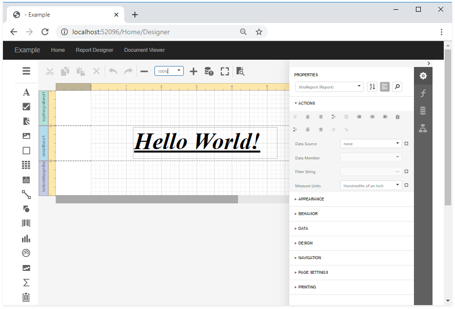

<!-- default badges list -->

<!-- default badges end -->
# End-User Report Designer and Document Viewer in ASP.NET Core Application

This example demonstrates how to use the [End-User Report Designer](https://docs.devexpress.com/XtraReports/400249) and [HTML5 Document Viewer](https://docs.devexpress.com/XtraReports/400248) in an ASP.NET Core application.

Prior to running this example, perform the following steps:

1. In Visual Studio, right-click the **package.json** file and select **Restore Packages**. This adds the node_modules folder to the application project.

2. Right-click the ASP.NET Core project file and select **Manage NuGet Packages**. In the invoked window, switch to the **Updates** page and update the **DevExpress.AspNetCore.Reporting** package. You may need to add a new NuGet package source to [install DevExpress NuGet packages](https://docs.devexpress.com/GeneralInformation/115912) or update them from the [local NuGet feed](https://docs.devexpress.com/GeneralInformation/401140).

3. Check whether you have the [latest Node.js version](https://nodejs.org/) installed and uninstall any previous version. To check Node.js version, type **node** at the command prompt.

For more information and step-by-step tutorials, refer to the following topics:

* [Create a Report in Visual Studio](https://docs.devexpress.com/XtraReports/14989)
* [Add an End-User Report Designer to an ASP.NET Core Application](https://docs.devexpress.com/XtraReports/400042)
* [Add the Document Viewer to an ASP.NET Core Application](https://docs.devexpress.com/XtraReports/400043)

